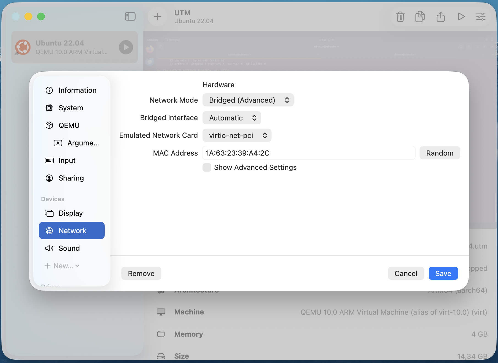
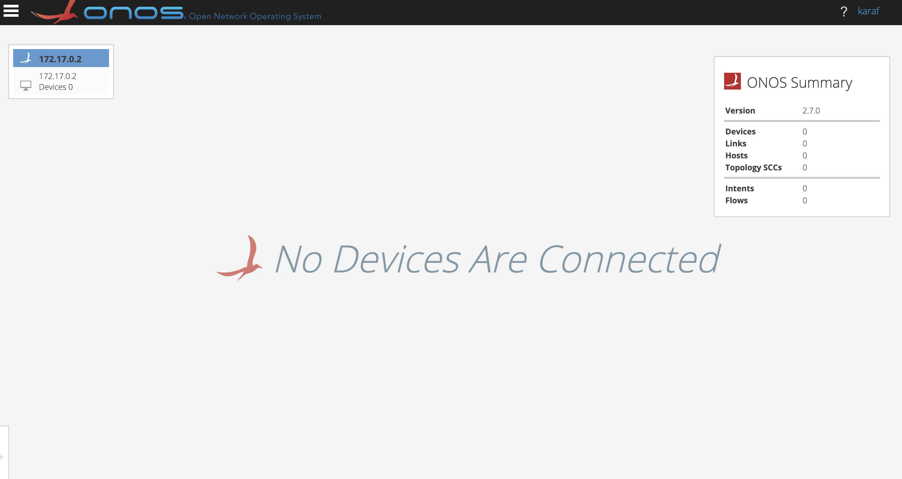
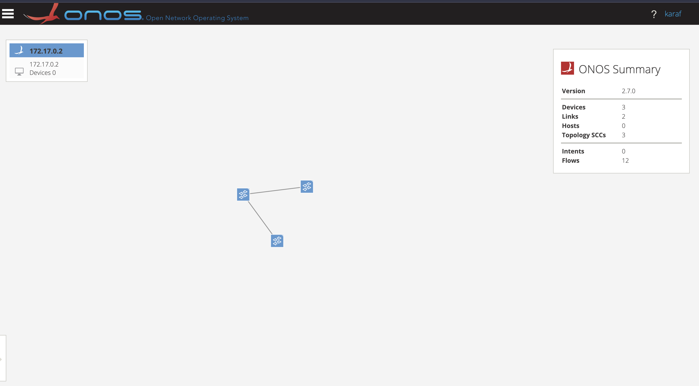
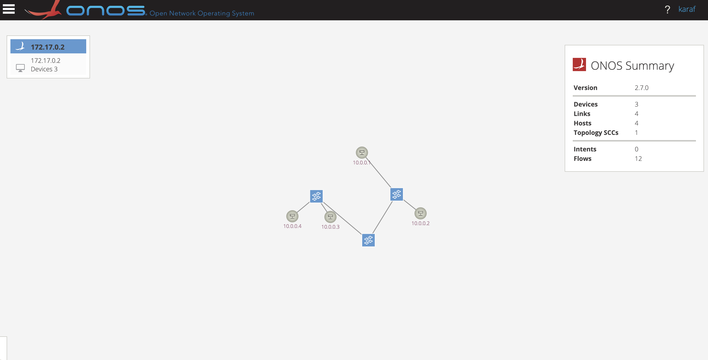
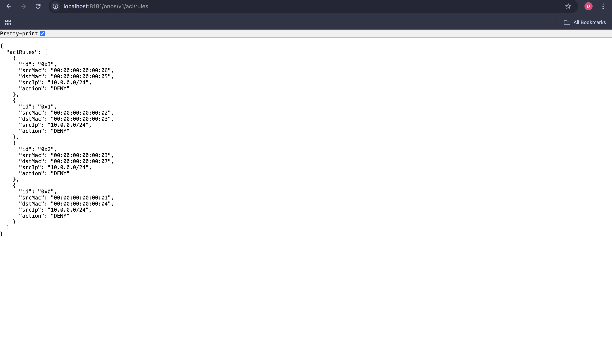
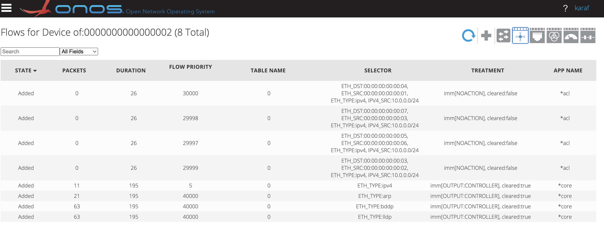

## Introduction

ONOS is the leading open-source SDN (Software-Defined Networking) controller specifically designed for service providers and enterprise networks. It provides a carrier-grade platform that balances high scalability, high availability, and massive performance.

Unlike traditional networking stacks, ONOS abstracts the underlying hardware, allowing operators to create and deploy innovative network services without needing to rewrite code for specific devices.

Key Pillars:
- High Availability: Distributed architecture ensures that the network remains operational even if individual controller nodes fail.

- Scalability: Seamlessly scales horizontally to manage massive wide-area networks (WANs) and data centers.

- Performance: Optimized for low-latency control and high-throughput flow processing.

- Modular Architecture: A rich set of APIs (Northbound and Southbound) allows for easy integration with various applications and diverse hardware protocols like OpenFlow, P4, and NETCONF.

This tutorial is specifically for the ARM architecture. We will cover how to install ubuntu on UTM and install Mininet on it. Also we will use docker to run ONOS which will use
rosseta, as onos has been written to work on x86 architecture.


## Installing Ubuntu (via UTM)

1) Open UTM and select Browse UTM Gallery.

2) Locate Ubuntu 22.04 ARM64.

3) Download the .utm package from the Archive.org link (account required).

4) Extract the ZIP file and double-click the .utm file to import it.
5) Network Configuration: Select the VM and click Settings (top right icon).Navigate to Network > Network Mode and select Bridge (Advanced).Set Emulated Network Card to virtio-net-pci.2. 



## Installing Mininet

Start the virtual machine and run:
```bash
sudo apt-get update
sudo apt-get install mininet
```

## Installing ONOS (Docker)

Ensure Docker is running on your host machine. Execute the following to pull and start ONOS 2.7.0
```bash
docker run -t -d --name onos27 --platform linux/amd64 -p 8181:8181 -p 8101:8101 -p 6653:6653 onosproject/onos:2.7.0
```

| Flag        | Name            | Function                                                                 |
|-------------|-----------------|--------------------------------------------------------------------------|
| `-t`        | TTY             | Allocates a virtual terminal; required for the ONOS Karaf shell to run correctly. |
| `-d`        | Detached        | Runs the container in the background, allowing you to keep using your terminal. |
| `--name`    | Container Name  | Assigns a unique name (`onos27`) for easier management instead of a random ID. |
| `--platform`| Architecture    | Forces `linux/amd64` compatibility; essential for running ONOS on Apple Silicon (M-series) chips. |
| `-p`        | Port Map        | Forwards host ports to the container: 8181 (Web GUI), 8101 (CLI), 6653 (OpenFlow). |


These ports (8181, 8101, 6653) are specified in the [ONOS requirement](https://wiki.onosproject.org/display/ONOS/Requirements)


You should see this in the docker logs

```zsh
12:49:47.878 INFO  [TldScanner] found TLD bundle://106.0:1/META-INF/c-1_0.tld
12:49:47.901 INFO  [TldScanner] found TLD bundle://106.0:1/META-INF/c-1_1.tld
12:49:47.910 INFO  [TldScanner] found TLD bundle://106.0:1/META-INF/c.tld
12:49:47.912 INFO  [TldScanner] found TLD bundle://106.0:1/META-INF/fmt-1_0-rt.tld
12:49:47.927 INFO  [TldScanner] found TLD bundle://106.0:1/META-INF/fmt-1_0.tld
12:49:47.932 INFO  [TldScanner] found TLD bundle://106.0:1/META-INF/fmt.tld
12:49:47.941 INFO  [TldScanner] found TLD bundle://106.0:1/META-INF/fn.tld
12:49:47.949 INFO  [TldScanner] found TLD bundle://106.0:1/META-INF/permittedTaglibs.tld
12:49:47.951 INFO  [TldScanner] found TLD bundle://106.0:1/META-INF/scriptfree.tld
12:49:47.952 INFO  [TldScanner] found TLD bundle://106.0:1/META-INF/sql-1_0-rt.tld
12:49:47.961 INFO  [TldScanner] found TLD bundle://106.0:1/META-INF/sql-1_0.tld
12:49:47.964 INFO  [TldScanner] found TLD bundle://106.0:1/META-INF/sql.tld
12:49:47.965 INFO  [TldScanner] found TLD bundle://106.0:1/META-INF/x-1_0-rt.tld
12:49:47.966 INFO  [TldScanner] found TLD bundle://106.0:1/META-INF/x-1_0.tld
12:49:47.968 INFO  [TldScanner] found TLD bundle://106.0:1/META-INF/x.tld
12:49:48.077 INFO  [ContextHandler] Started HttpServiceContext{httpContext=WebAppHttpContext{org.onosproject._onos-gui2-base-jar - 198}}
12:49:48.111 INFO  [ContextHandler] Started HttpServiceContext{httpContext=WebAppHttpContext{org.onosproject.onos-apps-acl - 213}}
12:49:48.128 INFO  [ContextHandler] Started HttpServiceContext{httpContext=WebAppHttpContext{org.onosproject.onos-rest - 197}}
12:49:48.707 INFO  [AtomixClusterStore] Updated node 172.17.0.2 state to READY
```


## Accessing the ONOS CLI

To access the ONOS controller's command-line interface via SSH
```bash
ssh -p 8101 karaf@localhost
```
Password: karaf
Troubleshooting: SSH Key Negotiation
If you receive an Unable to negotiate error (common in newer SSH clients that disable RSA by default), use this command
```bash
ssh -o HostKeyAlgorithms=+ssh-rsa -o PubkeyAcceptedAlgorithms=+ssh-rsa -p 8101 karaf@localhost
```

### Using the ONOS CLI
Once logged into the Apache Karaf console, you can manage the controller and the network fabric using specific ONOS commands.

```bash
karaf@root >
```

### Essential Commands

| Command | Description |
| :--- | :--- |
| `apps -a -s` | List all active applications. |
| `app activate <app_name>` | Activate a specific application (e.g., `fwd` for reactive forwarding). |
| `devices` | List all network devices (switches) discovered by the controller. |
| `links` | View the discovered links between devices. |
| `hosts` | List all end-hosts detected on the network. |
| `summary` | Get a high-level overview of the controller status. |
| `logout` | Exit the ONOS CLI. |

## GUI (Graphical User Interface)

ONOS provides a powerful web-based interface to visualize your network topology, monitor traffic flows, and manage applications in real-time.

Accessing the Interface
1) Open a web browser (Chrome is recommended) on your host machine.

2) Navigate to: http://localhost:8181/onos/ui

3) Log in with the following credentials:
- Username: onos
- Password: rocks


### Dashboard Overview

Upon logging in, you will be redirected to the Topology View.
This view provides a real-time graphical representation of the network infrastructure managed by your controller. Note that if you have not yet started Mininet or connected any switches, the canvas will appear empty.
You can also check this by running the following command in the ONOS CLI:
```bash
karaf@root > devices
```




### Start mininet

Now go back to your virtual machine and start up mininet with the following command with your ip adress
find it with


```bash
ubuntu@ubuntu:~$ sudo mn --controller=remote,ip=192.xxx.x.xxx,port=6653 --topo=tree,2,2 --switch ovs,protocols=OpenFlow13 --mac
```
- `sudo mn`	runs Mininet with root privileges.
- `--topo tree,2,2` creates a new tree topology with depth 2 and fanout 2
- `--mac` Automatically assigns easy-to-read MAC addresses (e.g., `00:00:00:00:00:01`) based on host ID.
- `--switch ovs,protocols=OpenFlow13` tells Mininet to use Open vSwitches using OpenFlow version 13
- `--controller remote,ip=192.xxx.x.xxx` Points the switches to a remote controller (your ONOS Docker container) at the specified IP. (IP of your machine)

### Troubleshooting

You might need to restart open vSwitch to remove past configuration
```bash
ubuntu@ubuntu:~$ sudo mn -c
ubuntu@ubuntu:~$ sudo service openvswitch-switch restart
```

## ONOS 
Even after starting Mininet, you may notice that the network topology does not appear in the GUI. This occurs because the ONOS core is protocol-agnostic; it does not "speak" OpenFlow by default. You must manually activate the OpenFlow provider application to enable communication with the switches.

Access the ONOS CLI via your host terminal and run the following command:
```bash
karaf@root > app activate org.onosproject.openflow
Activated org.onosproject.openflow
```

You can verify all active apps via 
```bash
apps -a -s
```

The following shortcuts can be usefull for the gui.

| Command | Description |
| :--- | :--- |
| `H` | Show/Hide host devices. |
| `L` | Show/Hide device labels (names/IDs). |
| `B` | Toggle background map (useful for geographic topologies). |
| `A` | Cycle through highlighting different types of traffic/stats. |

At this stage, ONOS should successfully discover the three switches created by Mininet. However, even if you press `H`, you will notice that no hosts are visible.



ONOS is a reactive controller; it only discovers hosts when they generate network traffic. To force discovery, you can use the `pingall` command in the Mininet CLI. However, if you run it now, the pings will fail

```bash
mininet> pingall
*** Ping: testing ping reachability
h1 -> X X X
h2 -> X X X
h3 -> X X X
h4 -> X X X
*** Results: 100% dropped (0/12 received)
```

Why is this happening? While the switches are connected via OpenFlow, the controller has no "intelligence" active to handle the incoming packets. It sees the traffic but doesn't know where to route it.


To fix this, you must activate the Reactive Forwarding application. This app tells ONOS to automatically install flow rules in the switches when it sees new traffic.

Run this command in the ONOS CLI:
```bash
karaf@root > app activate org.onosproject.fwd
Activated org.onosproject.fwd
```
Once activated, run `pingall` in Mininet again. The pings will now succeed, and the hosts will appear in your GUI.



# Layer 2 Firewall with Access Control Lists (ACLs)

In this section, we will implement a Layer 2 firewall using our existing Mininet topology. Rather than writing a custom firewall script, we will utilize the pre-installed ACL (Access Control List) application provided by ONOS.

What is an ACL?

An Access Control List is a set of rules used to filter network traffic. In an SDN context, these rules allow the controller to inspect incoming packets and decide whether to forward or "deny" (drop) them based on specific criteria, such as MAC addresses or port numbers.

Step 1: Activating the ACL Application

By default, the ACL features are not active. You must enable the application via the ONOS CLI:

```bash
karaf@root > app activate org.onosproject.acl
```

## Firewall Implementation via REST API

The ACL application provides a REST API that allows external scripts and tools to dynamically add or remove security rules. The API endpoint is available on your host machine at:

http://localhost:8181/onos/v1/acl/rules

## Automating Security Policies

Manually sending POST requests for every individual rule is inefficient for large networks. To streamline this process, we have developed a Python script [firewall.py](firewall.py)  that automates the enforcement of security policies.

```python
import sys
import csv
import requests

# ONOS REST API Configuration
HOST = "localhost"
PORT = "8181"
USER = "karaf"
PASS = "karaf"
URL  = f"http://{HOST}:{PORT}/onos/v1/acl/rules"
HEADERS = {'Content-type': 'application/json'}

# 1. Load security policies from CSV
policy_file = "firewall-policies.csv"
firewall_rules = []

with open(policy_file, 'r') as csvfile:
    rows = csv.reader(csvfile, delimiter=',')
    next(rows) # Skip header row
    for row in rows:
        # Append (Source MAC, Destination MAC)
        firewall_rules.append((row[1], row[2]))

# 2. Push rules to ONOS via REST API
for src_mac, dst_mac in firewall_rules:
    payload = {
        "srcIp": "10.0.0.0/24",
        "srcMac": src_mac,
        "dstMac": dst_mac
    }
    
    response = requests.post(
        URL, 
        json=payload, 
        auth=(USER, PASS), 
        headers=HEADERS
    )
    
    print(f"Status: {response.status_code} - Applied rule for {src_mac} -> {dst_mac}")
```

run the script in your host machine terminal:
```bash
python3 firewall.py 
```

The script functions by:

- Parsing the [firewall policy](firewall-policies.csv) file.

- Extracting MAC address pairs that should be prohibited from communicating.

- Generating and sending the corresponding ACL rules to the ONOS REST API.

You can then check if the rules where applied by going to http://localhost:8181/onos/v1/acl/rules



Furthermore, running the pingall command in Mininet will now block certain connections:

```
bash
mininet> pingall
*** Ping: testing ping reachability
h1 -> h2 h3 X
h2 -> h1 X h4
h3 -> h1 X h4
h4 -> X h2 h3
*** Results: 33% dropped (8/12 received)
```

A key advantage of ONOS is the ability to visually inspect the specific Flow Rules that the controller has pushed to the switches. This is particularly useful for verifying that your Python script successfully pushed the ACL rules or that the Reactive Forwarding app is functioning.

To verify that your security policies are active, you can select any switch within the ONOS topology view to open its specific details panel. Within this panel, clicking the "Flows" icon displays the actual flow table currently installed on that device.

This table provides a transparent look at how the controller is managing traffic. You will notice entries associated with the acl application, which correspond to the MAC address pairs defined in your [CSV file](firewall_policy.csv). By inspecting the `Treatment` or `Action` column for these entries, you can confirm that the switch is explicitly dropping packets between restricted hosts. Meanwhile, you will see separate entries with a forward or output action, indicating that the reactive forwarding application is still handling all other legitimate network traffic. This distinction allows you to see the firewall and the routing logic working side-by-side in the network fabric.

